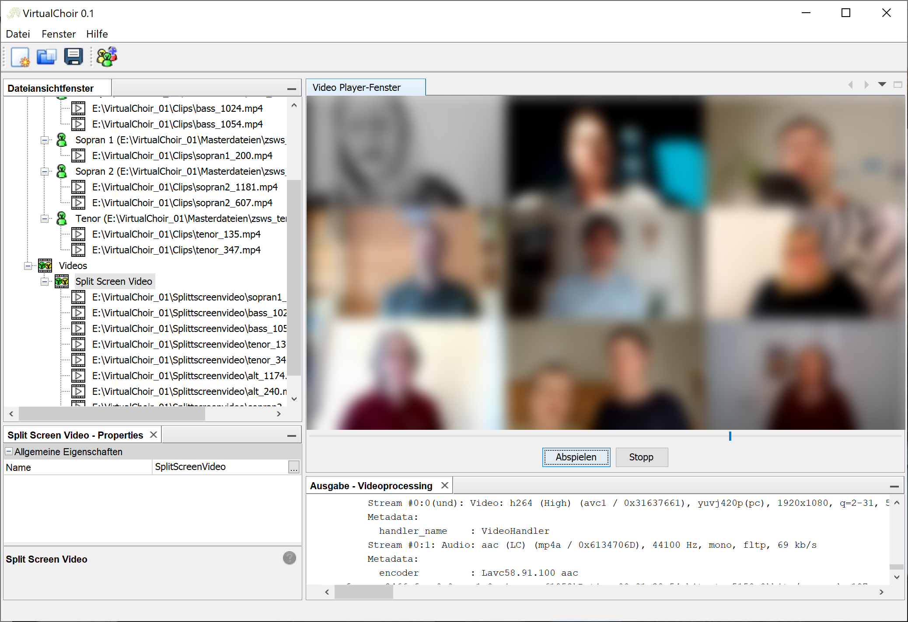
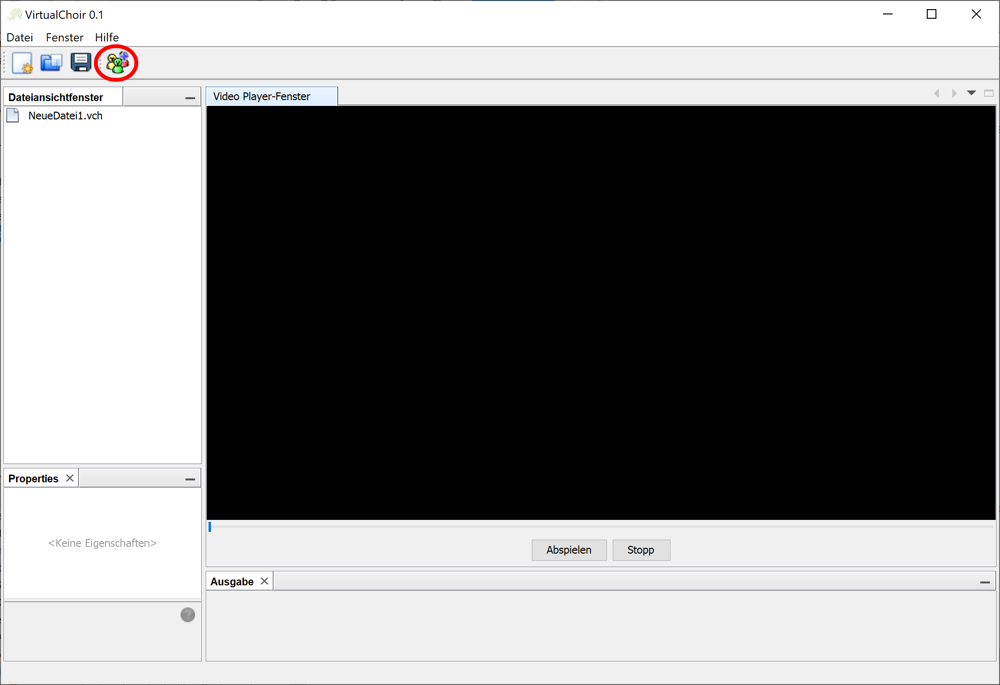
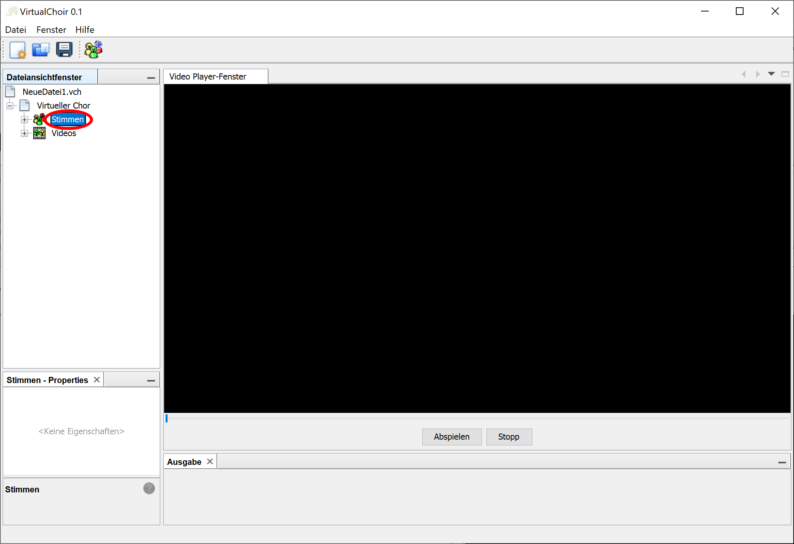
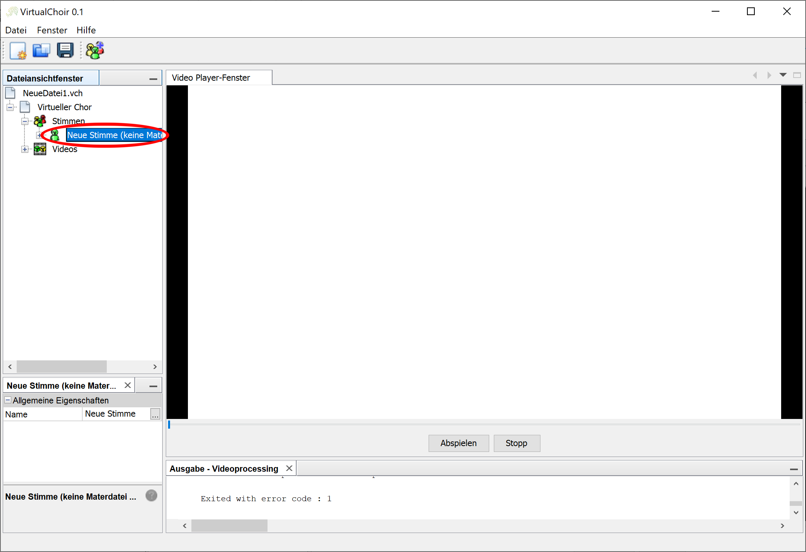
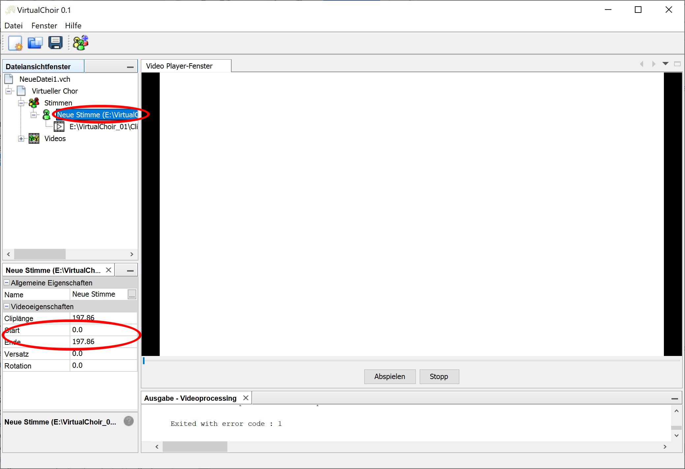
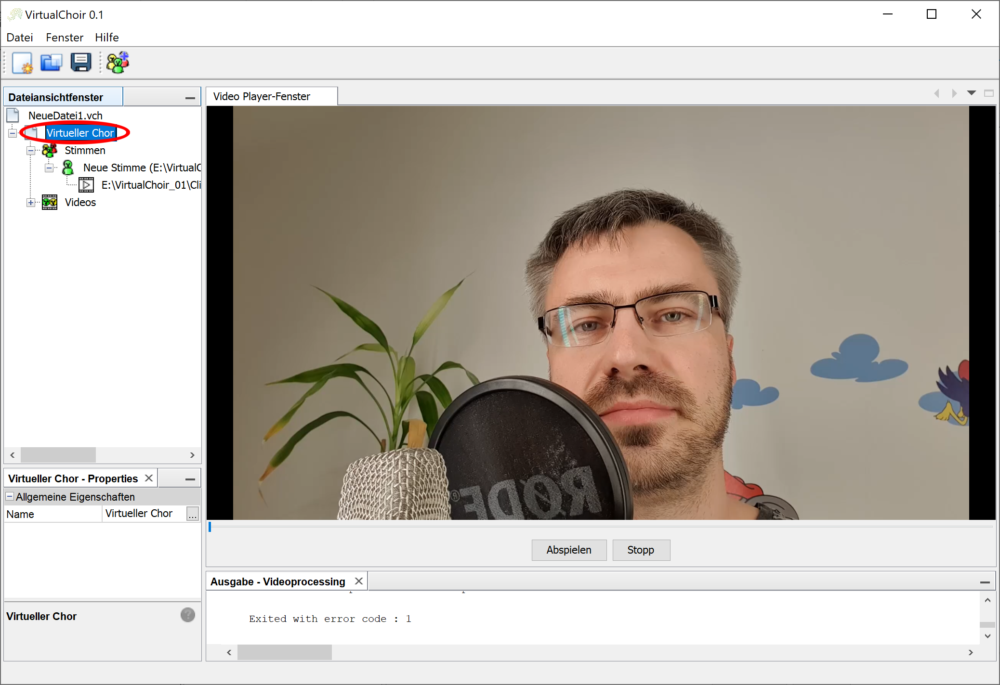
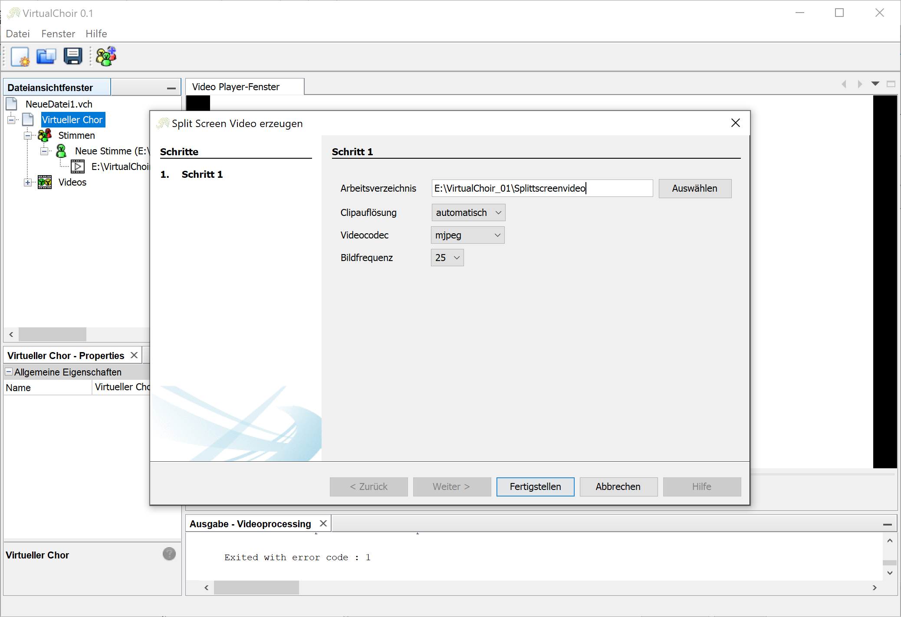

# VirtualChoir

[Deutsch](https://github.com/AndiMb/VirtualChoir/blob/master/LIESMICH.md)

VirtualChoir is a program based on the [Netbeans Platform](https://netbeans.apache.org/) and thus on [Java](https://de.wikipedia.org/wiki/Java_(Programmiersprache)) to create split-screen videos for virtual choirs easily, quickly and without any prior knowledge.

## Software and Libraries

- [FFmpeg](https://www.ffmpeg.org/) - encoding of the individual clips and rendering of the entire video
- [Praat](https://www.fon.hum.uva.nl/praat/) - Determination of the offset of the individual clips concerning the master file (syncing)
- [vlcj](https://github.com/caprica/vlcj) - Play the videos

## Features

- any number of parts, e.g. soprano, alto, ...
- any number of videos/clips
- automatic synchronization of the individual clips with regard to the part master
- different video codecs can be used
- all raw data are available for manual processing after the video has been created

## Requirements

- Video clips of the individual singers with audio, which can be read with FFmpeg, with an assignment to the part
- one master file for each voice group (video + audio or audio only), whereby the master files must be synchronized with each other, e.g. an MP3 export of each voice from the sheet music

## How to

1. Download the ZIP file
  - [Windows](https://github.com/AndiMb/VirtualChoir/releases/download/v0.1.1/virtualchoir_0.1.1_windows.zip)
  - [Linux](https://github.com/AndiMb/VirtualChoir/releases/download/v0.1.1/virtualchoir_0.1.1_linux.tar.gz)

2. Open the Program
  - Excelcutable in the "bin" directory

3. Create a new virtual choir by left-clicking on the button

4. Add new voices by right-clicking on the parts

5. With a right click on the respective part, add the master files and the individual video clips

6. Adjust the start and end of the relevant part in the master files

7. Start split screen video generation with a right click on "Virtual Choir"

8. Specify the output directory and the desired setting

## Alternatives

  https://docs.google.com/document/d/1QK-PVHsBMGDT5RCx258rMFw1Aww4yGV8YkmHjXPrrsc/edit
